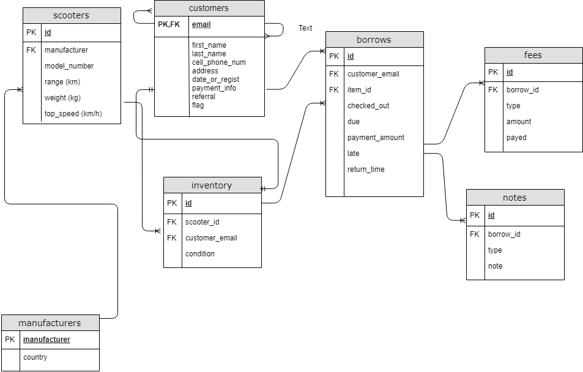
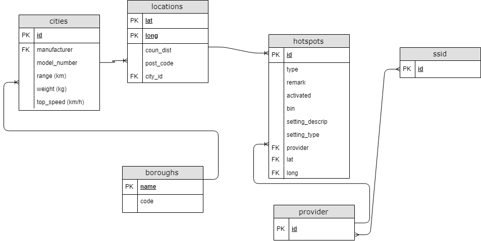

# Homework 05

## Scoot-Share

* TODO: a list of design decisions 
-Customer information not related to transactions was stored in one table because there wasn't much of a relationship between the different fields.  
-There is a one to one relationship between inventory and customer where the foreign key is customer_email. This field was made to make it easier to find out which scooters are free. When it equals null, no customer is currently borrowing it, and is thus free. 
-We have a many to one relationship between inventory, which are the items (scooters) that we have, and scooters. The scooters table holds records on the different models of scooters we have. We assume model refers to a particular kind of scooter, and therefore we can have many scooters of a given model.                                                                                                         
-We have a table that records all of the borrows that have taken place. If the return time is null, then the scooter that was borrowed has not been returned yet.  
-Then we have a one to many relationships between borrows and fees, and borrows and notes. This is because for one instance of borrowing a scooter, there can be several feels and notes.  

* TODO: a list of assumptions 
-Assumed that different items (scooters) in the inventory can have the same model number.  
-Assumed that payment info can simple by stored as a varchar. 
-We assume that scooters of the same model can be labeled with the same information. 
-We also assume that model_number can be the same for two different kind of scooters. For example two companies might release scooters with the same model number.  

Scripts

* [part-1-scoot-share-create.sql](scoot-share/part-1-scoot-share-create.sql)
* [part-1-scoot-share-queries.sql](scooter-share/part-1-scoot-share-queries.sql)

## Normalization

* [part-2-normalization-create.sql](nyc-hotspots/part-2-normalization-create.sql)
* [part-2-normalization-import.sql](nyc-hotspots/part-2-normalization-import.sql)
* [part-2-normalization-queries.sql](nyc-hotspots/part-2-normalization-queries.sql)
